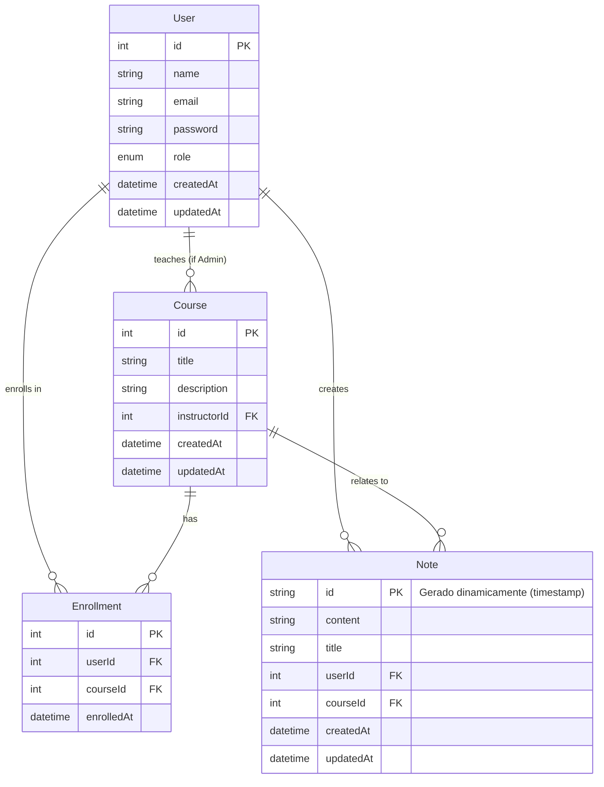

# Sistema de Gestão de Cursos e Anotações

Este é um projeto fullstack desenvolvido como atividade prática, que implementa um sistema web para gerenciamento de cursos e anotações de alunos. A aplicação utiliza um banco de dados relacional (SQLite) e um banco de dados não-relacional simulado (arquivo JSON).

## Funcionalidades Principais

*   **Autenticação:** Cadastro e login de usuários (Alunos e Administradores) com JWT.
*   **Gerenciamento de Cursos (Admin):** Criação, visualização, atualização e exclusão de cursos.
*   **Visualização de Cursos (Aluno):** Listagem e visualização de detalhes dos cursos.
*   **Matrícula (Aluno):** Alunos podem se matricular e cancelar matrícula em cursos.
*   **Gerenciamento de Anotações (Aluno):** Criação, visualização e exclusão de anotações pessoais por curso.
*   **Painel Administrativo (Admin):** Visualização de estatísticas, gerenciamento de usuários e cursos.
*   **Perfil de Usuário:** Visualização e atualização de informações pessoais.

## Tecnologias Utilizadas

*   **Frontend:** React (com Vite), React Router, Axios, Tailwind CSS (configuração básica)
*   **Backend:** Node.js, Express.js, Prisma ORM, JWT (jsonwebtoken), Bcrypt.js
*   **Banco de Dados Relacional:** SQLite
*   **Banco de Dados Não-Relacional:** Simulado com arquivo JSON (`backend/src/db/notes.json`)
*   **Documentação da API:** Swagger (OpenAPI 3.0) via `swagger-ui-express` e `swagger-jsdoc`

## Estrutura do Projeto

```
curso-gestao/
├── backend/             # Código do servidor backend
│   ├── prisma/          # Schema e migrações do Prisma
│   │   └── schema.prisma
│   ├── src/
│   │   ├── config/      # Configurações (DB, JWT, Swagger)
│   │   ├── controllers/ # Lógica de requisição/resposta
│   │   ├── db/          # Lógica do banco não-relacional (JSON)
│   │   ├── middlewares/ # Middlewares (autenticação, autorização)
│   │   ├── routes/      # Definição das rotas da API
│   │   └── services/    # Lógica de negócios
│   ├── .env             # Variáveis de ambiente (exemplo)
│   ├── app.js           # Arquivo principal do Express
│   └── package.json
├── frontend/            # Código da aplicação frontend
│   ├── public/
│   ├── src/
│   │   ├── components/  # Componentes reutilizáveis
│   │   ├── contexts/    # Contexto de autenticação
│   │   ├── pages/       # Componentes de página
│   │   ├── App.jsx      # Componente principal e roteamento
│   │   └── main.jsx     # Ponto de entrada do React
│   ├── index.html
│   ├── package.json
│   └── vite.config.js
├── documentacao/        # Arquivos de documentação
│   ├── diagrama_caso_uso.md
│   └── diagrama_banco_dados.md
└── todo.md              # Checklist de desenvolvimento (interno)
```

## Instruções de Instalação e Execução

**Pré-requisitos:**

*   Node.js (versão 18 ou superior recomendada)
*   NPM (geralmente vem com o Node.js)

**Passos:**

1.  **Clonar o repositório (ou extrair o ZIP):**
    ```bash
    # git clone <url_do_repositorio>
    cd curso-gestao
    ```

2.  **Instalar dependências do Backend:**
    ```bash
    cd backend
    npm install
    ```

3.  **Configurar variáveis de ambiente do Backend:**
    *   Renomeie ou copie o arquivo `.env.example` (se existir) para `.env`.
    *   Certifique-se que as variáveis `DATABASE_URL` e `JWT_SECRET` estão definidas. O padrão para SQLite é `DATABASE_URL="file:../dev.db"`.

4.  **Executar migrações do Banco de Dados (Backend):**
    *   Este comando criará o arquivo do banco de dados SQLite (`dev.db`) e aplicará o schema.
    ```bash
    npx prisma migrate dev --name init
    ```

5.  **Iniciar o Servidor Backend:**
    ```bash
    npm start 
    # Ou para desenvolvimento com Nodemon (se configurado):
    # npm run dev 
    ```
    O backend estará rodando em `http://localhost:3001` (ou a porta definida em `.env`).

6.  **Instalar dependências do Frontend (em outro terminal):**
    ```bash
    cd ../frontend
    npm install
    ```

7.  **Iniciar a Aplicação Frontend:**
    ```bash
    npm run dev
    ```
    O frontend estará acessível em `http://localhost:3000` (ou a porta definida no `vite.config.js`). O proxy configurado no Vite redirecionará as chamadas `/api` para o backend.

## Documentação da API (Swagger)

Com o servidor backend rodando, a documentação interativa da API gerada pelo Swagger pode ser acessada no seguinte endereço:

[http://localhost:3001/api-docs](http://localhost:3001/api-docs)

## Diagramas

### Diagrama de Caso de Uso

(Conteúdo do arquivo `documentacao/diagrama_caso_uso.md`)

### Diagrama de Banco de Dados (Relacional + Não-Relacional)

(Visualização do código Mermaid em `documentacao/diagrama_banco_dados.md`)


*(Nota: O diagrama Mermaid acima representa as entidades principais e seus relacionamentos. A entidade `Note` é gerenciada via arquivo JSON no backend.)*
