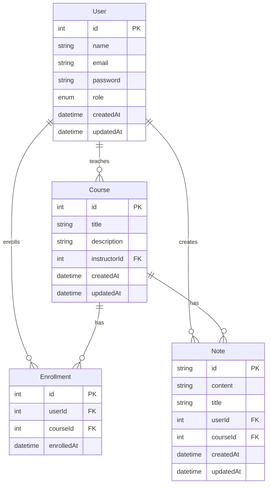

```mermaid
erDiagram
    User {
        int id PK
        string name
        string email
        string password
        enum role
        datetime createdAt
        datetime updatedAt
    }
    
    Course {
        int id PK
        string title
        string description
        int instructorId FK
        datetime createdAt
        datetime updatedAt
    }
    
    Enrollment {
        int id PK
        int userId FK
        int courseId FK
        datetime enrolledAt
    }
    
    Note {
        string id PK
        string content
        string title
        int userId FK
        int courseId FK
        datetime createdAt
        datetime updatedAt
    }
    
    User ||--o{ Course : "teaches"
    User ||--o{ Enrollment : "enrolls"
    Course ||--o{ Enrollment : "has"
    User ||--o{ Note : "creates"
    Course ||--o{ Note : "has"
```
